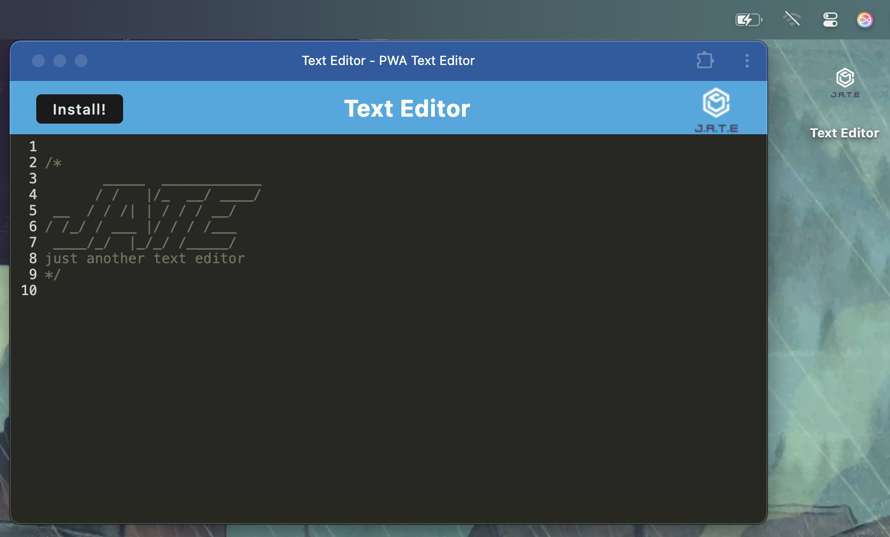
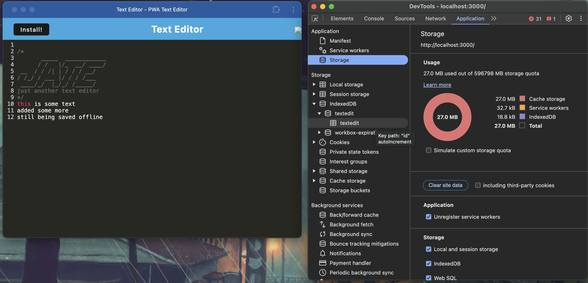
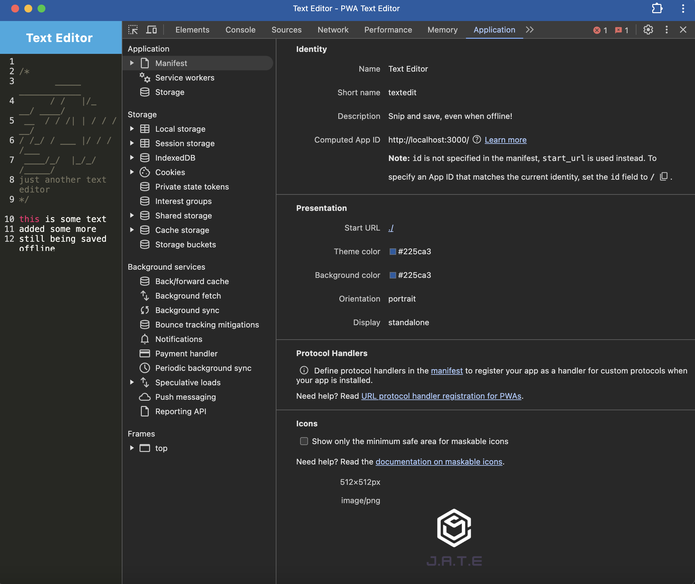
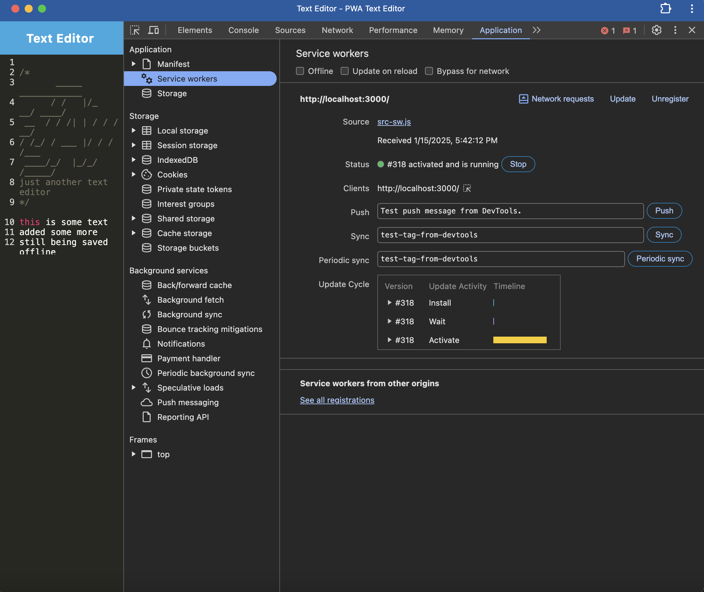
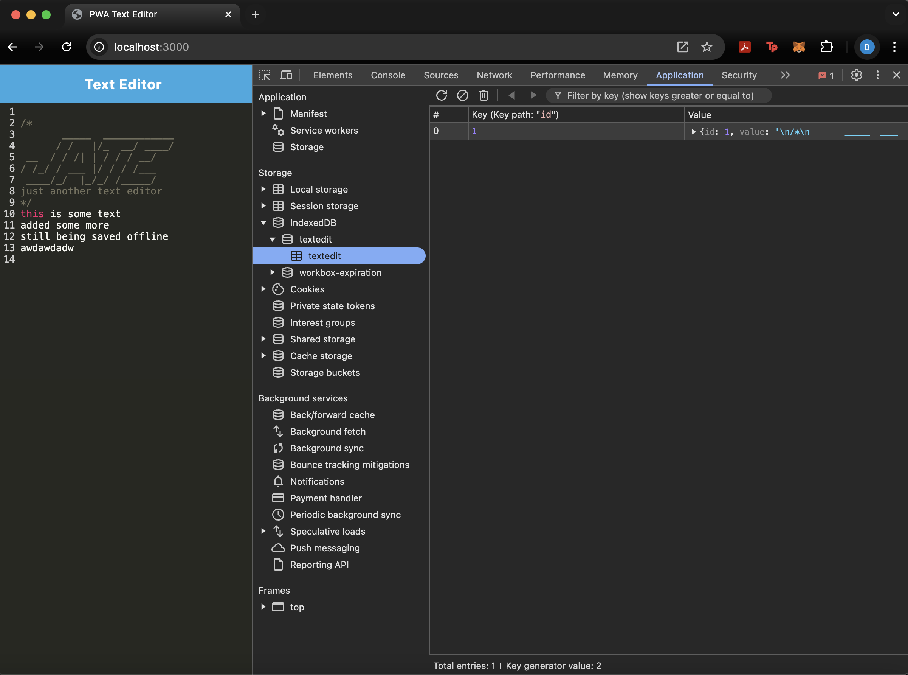

# PWA Text Editor







---

[View Video Demo](https://drive.google.com/file/d/1UJt9FC_1FVIpmlnB3g5dTb5At97Fd7tQ/view?usp=sharing)
or
[Try The App](https://pwa-text-editor-ewu6.onrender.com)

---

## Table of Contents

- [Overview](#overview)
- [Key Features](#key-features)
- [Concepts Covered](#concepts-covered)
- [Installation and Usage](#installation-and-usage)
  - [Installation](#installation)
  - [Access the Application](#access-the-application)
- [Example Usage](#example-usage)
- [Technologies Included](#technologies-included)
- [Summary](#summary)

---

## Overview

JATE (Just Another Text Editor) is a Progressive Web Application (PWA) that allows users to create notes or code snippets with or without an internet connection. It utilizes modern web development practices such as IndexedDB for data persistence, a service worker for offline functionality, and Webpack for bundling. The application can also be installed as a PWA, providing a seamless and responsive user experience.

---

## Key Features

1. **Data Persistence with IndexedDB**:

   - Saves and retrieves content from IndexedDB for offline usage.
   - Automatically saves content when the browser window is unfocused.

2. **Offline Functionality**:

   - Fully functional without an internet connection using a service worker and caching strategies.

3. **PWA Installation**:

   - Includes an "Install" button to add the application to your desktop or mobile home screen.

4. **Bundled with Webpack**:

   - Generates optimized JavaScript, CSS, and static files for efficient loading.

5. **Modern JavaScript Support**:

   - Uses Babel to transpile ES6+ features for cross-browser compatibility.

6. **Custom Service Worker**:

   - Caches static assets and pages for faster loading and offline support.

7. **Manifest Integration**:
   - Provides a `manifest.json` for configuring PWA behavior.

---

## Concepts Covered

- Progressive Web Applications (PWA)
- IndexedDB with the `idb` package
- Service workers for caching and offline functionality
- Webpack bundling with plugins for HTML, PWA manifests, and service workers
- Modern JavaScript development with Babel

---

## Installation and Usage

### Installation

1. Install dependencies for the project:

   ```bash
   npm install
   ```

2. Build the client-side files:

   ```bash
   npm run build
   ```

3. Start the application:
   ```bash
   npm start
   ```

### Access the Application

1. Open your browser and navigate to:

   ```
   http://localhost:3000
   ```

2. Use the text editor to enter content. It will be saved automatically.

3. Test offline functionality by turning off your internet connection and refreshing the page.

4. Click the "Install" button to add the app to your home screen or desktop.

---

## Example Usage

1. Enter notes or code snippets in the text editor.
2. Close and reopen the browser or refresh the page to confirm data persistence.
3. Test the install functionality by adding the app to your device.

---

## Technologies Included

- **Frontend**:
  - HTML, CSS
  - JavaScript (ES6+)
  - IndexedDB (`idb` package)
  - Service workers (via Workbox)
- **Bundling**:
  - Webpack
  - Babel
- **Backend**:
  - Node.js
  - Express.js

---

## Summary

JATE demonstrates the implementation of a Progressive Web Application with offline functionality, IndexedDB integration, and modern web development practices. It serves as a great example of how to create a responsive and installable web application.

---
